## ML-Agent 개발을 위한 윈도우 개발환경 설정

맥,리눅스와 달리 윈도우OS에서 유니티 ML-Agent 개발환경은 일반적으로 Anaconda를 설치하는 것이 많이 소개되있다. 파이썬과 머신러닝에 많이 사용되는 Jupyter notebook 외에 다양한 패키지를 자동으로 설치할 수 있는 장점이 있지만 설치과정이 살짝 번거로와 VS Code를 사용하는 방법을 소개한다.

### Visual Studio Code 설치

Visual Studio Code(이하 VSCode라 지칭)를 설치한다.

[VSCode 설치 URL](https://code.visualstudio.com/)

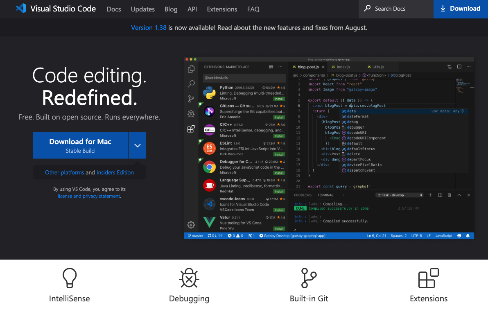

- C# 확장팩을 설치한다.

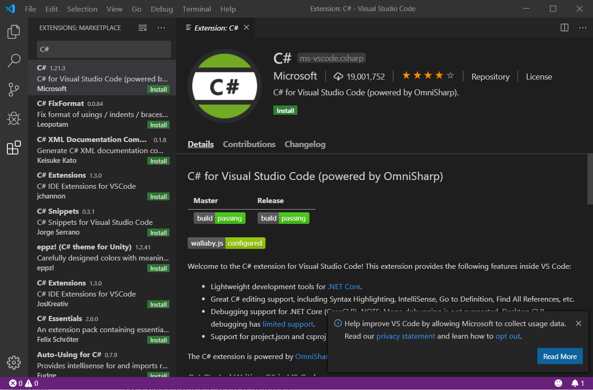

- C# 확장팩 설치한 후 자동으로 .Net Core SDK를 설치하겠는냐는 다이얼로그가 뜨면 [Read More] 버튼을 클릭한다.

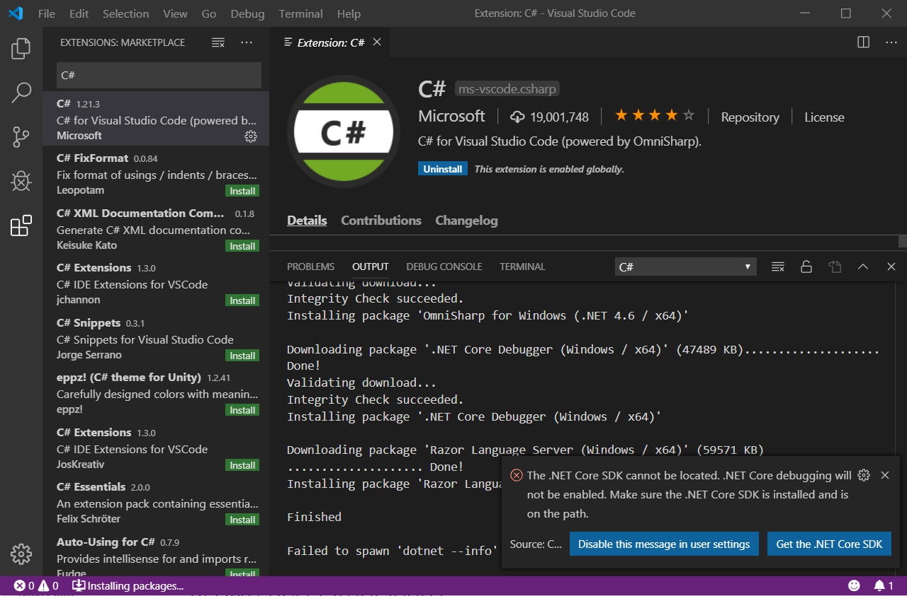

- .Net Core SDK를 다운로드할 수 있는 페이지로 연결되면 다운로드한 후 설치과정을 진행한다.

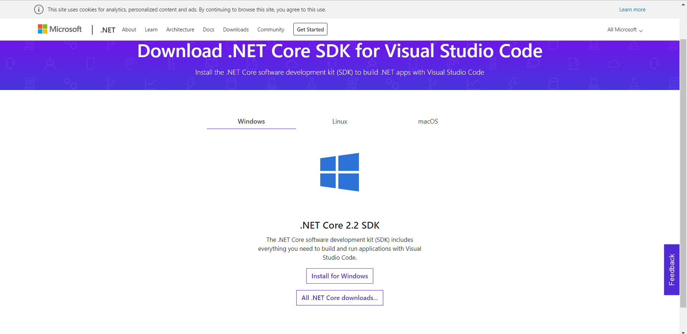


여기까지 설치한 후 Git과 ml-agents 소스를 마저 다운로드한 후 추가 패키지를 내려받는 부분은 뒷 부분에서 다시 언급한다.

### Git 설치

윈도우OS에는 Git이 기본 설치가 않되어 있기에 다음 주소에 접속해 Git을 다운로드 한 후 설치한다.

[www.git-scm.com](http://www.git-scm.com)


- 설치 과정

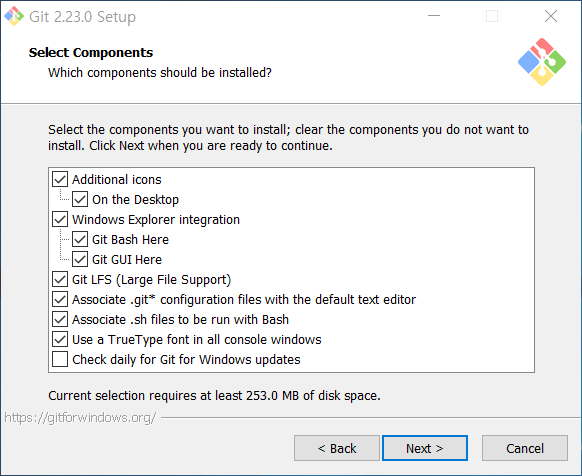

- Git의 기본 에디터 설정: Visual Studio Code를 선택한다.

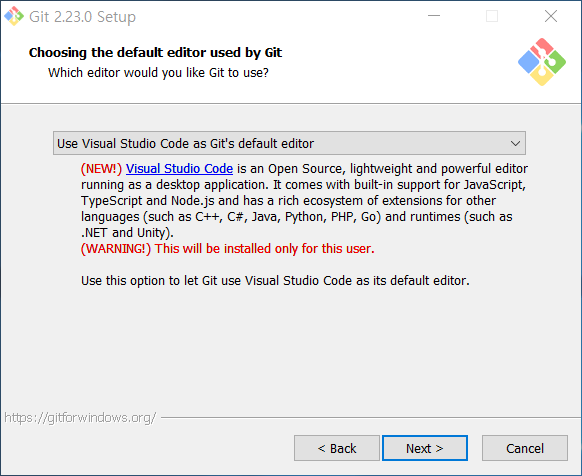

- PATH 설정 옵션: 2번째를 선택한다.

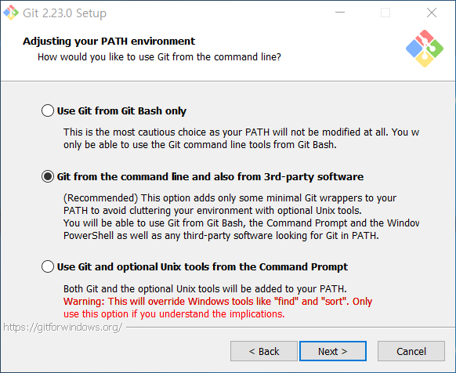

- 파일의 라인피드 옵션 설정: 첫 번째 옵션을 선택한다. 윈도우OS에서 라인 끝의 줄바꿈은 CRLF이고 맥/리눅스는 LF이기 때문에 윈도우OS와 맥/리눅스를 번갈아서 사용한다면 원격 저장소로 push할 때는 CRLF를 LF로 자동으로 변경하고 원격 저장소에서 내려받을 때는 LF를 CRLF로 자동 변환시켜주는 옵션이다.

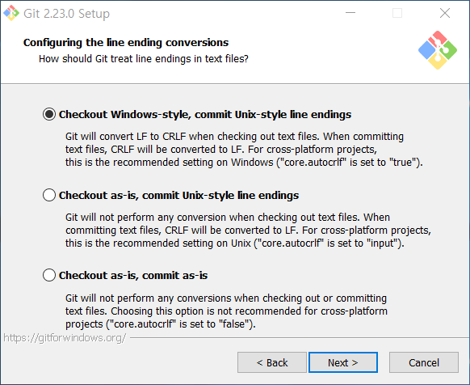

### 파이썬(Python) 설치

현재(2019/09/22) 유니티 ml-agents(v0.9)에서 사용하는 파이썬 버전은 3.6버전이기 때문에 최신버전을 받으면 않된다. 따라서 다음 주소에서 이전 버전의 파이썬을 다운로드한다.

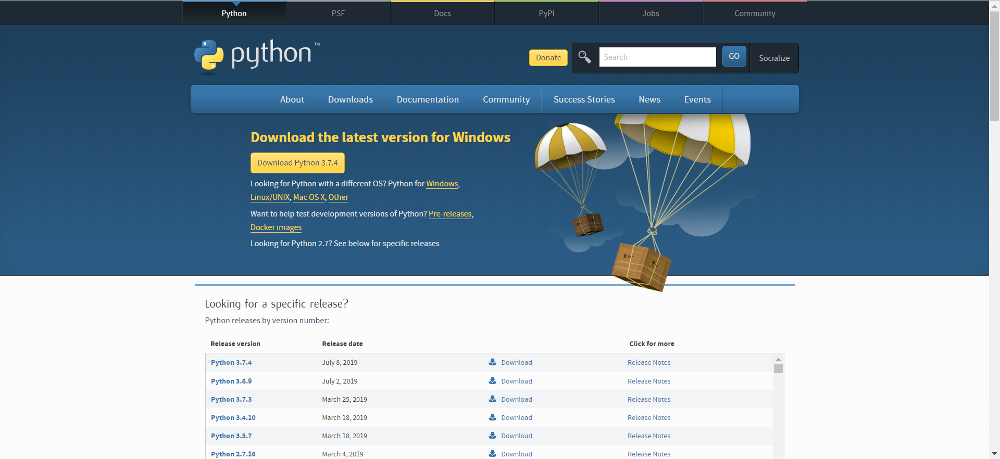

3.6.8 버전(64비트)의 파이썬 설치파일을 내려받는다.
설치 실행파일의 첫 화면의 하단에 있는 **[Add Python 3.8 to PATH]** 속성은 반드시 체크해야만 윈도우 환경 변수에 파이썬 경로가 등록되기에 잊지말고 체크한다.

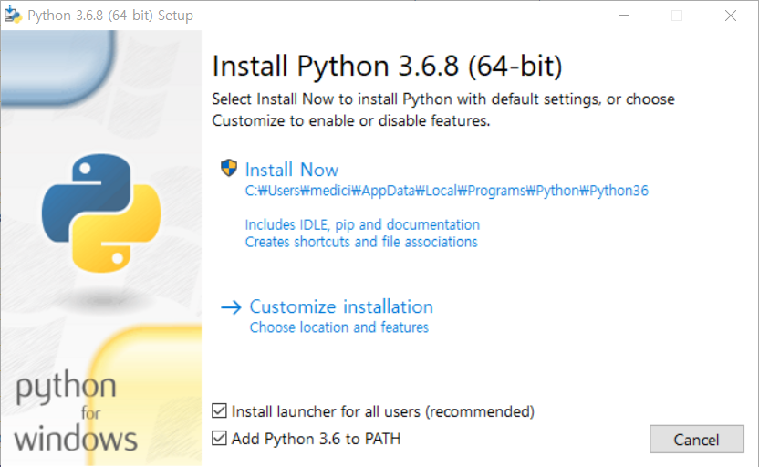

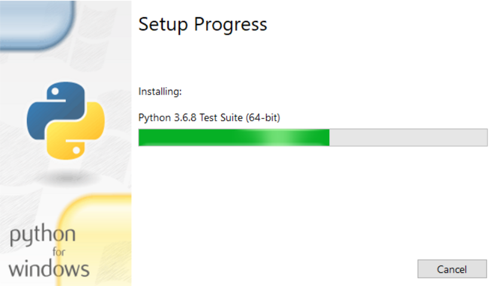

윈도우OS의 설정에 따라서 마지막 설치 화면에서 "Disable path length limit"가 나오면 클릭해 PATH의 길이제한이 없도록 설정한다.

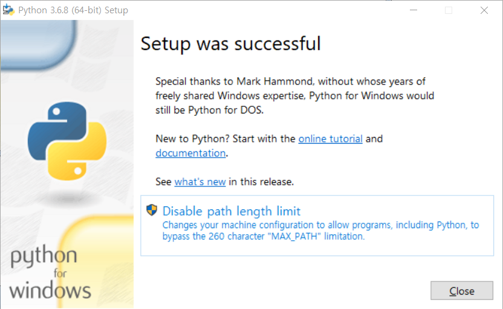

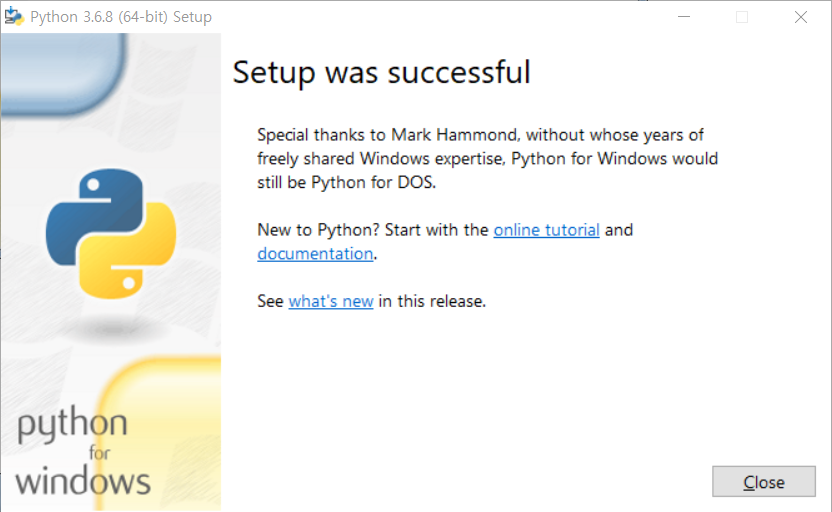

### ML-Agents 소스 내려받기

유니티 ML-Agents는 다음 주소에서 내려받을 수 있다.

[ML-Agents URL](https://github.com/Unity-Technologies/ml-agents)

- Git 명령어를 통해 설치
```sh
git clone https://github.com/Unity-Technologies/ml-agents
```
- Github desktop에서 Clone a repository를 통해 설치

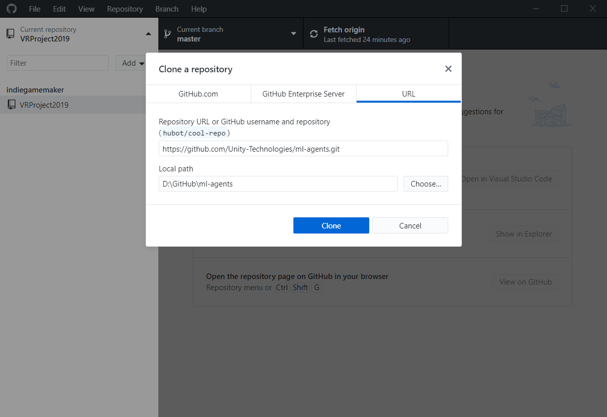

### ML-Agents 설정 및 추가 패키지 설치

윈도우의 명령 프롬프트(cmd)에서 진행해도 되지만 VSCode에서 터미널을 열어 진행한다. VSCode를 실행한 후 단축키 (ctrl+shift+`)를 누르면 하단에 터미널이 오픈된다.

- ML-Agents의 설치경로 ml-agents/ml-agents로 이동한다. 만약 ML-Agents가 D드라이브의 Github 폴더 하위에 저장했다면 다음과 같이 폴더을 이동한다.

```sh
cd /d/Github/ml-agents/ml-agents
```

- 파이썬을 처음 설치했다면 먼저 파이썬 설치 모듈인 pip를 다음과 같은 명령어로 업그레이드 한다.

```sh
$python -m pip install --upgrade pip
```

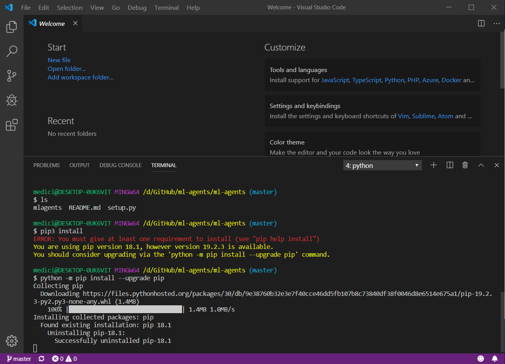

pip 모듈 업데이트가 끝난 후 다음 명령어로 ml-agents의 의존성 패키지를 설치한다.

```sh
$pip3 install .
```

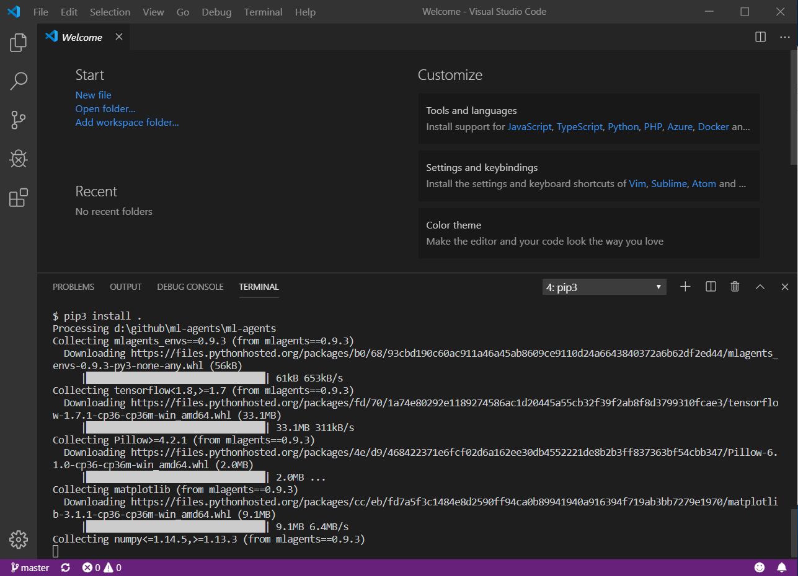

- 의존성 패키지중 pillow 버전이 맞지 않는다는 경고 문구가 뜬다면 다음과 같이 ml-agents에 맞는 버전을 수동으로 설치한다.

```sh
$pip uninstall pillow
$pip install pillow==5.4.1
```

- ML-Agents의 정상적인 설치 여부 확인

```sh
$mlagents-learn --help

```

### 파이썬 확장팩 설치

VSCode의 확장 기능에서 Python으로 검색해 Python 확장팩을 설치한다.

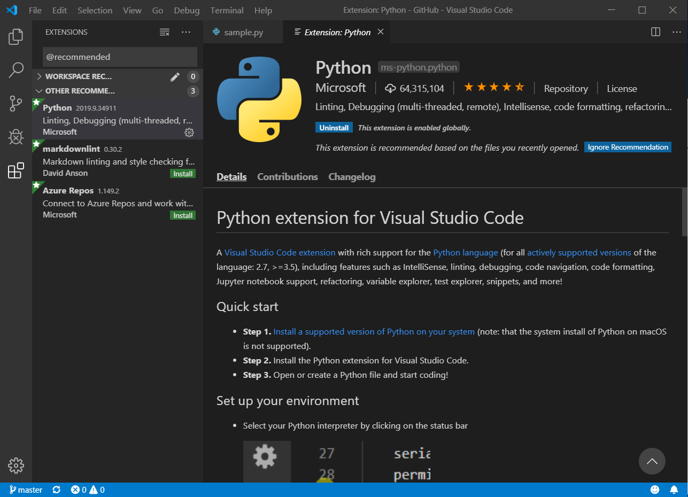

Python 확장팩 설치 후 pylint을 설치하라는 다이얼로그가 뜨면 역시 설치한다.
pylint 설치 후 윈도우 환경 변수의 PATH에 다음 경로를 추가한다.

>C\Users\{유저명}\AppData\Roaming\Python\Python32\Scripts

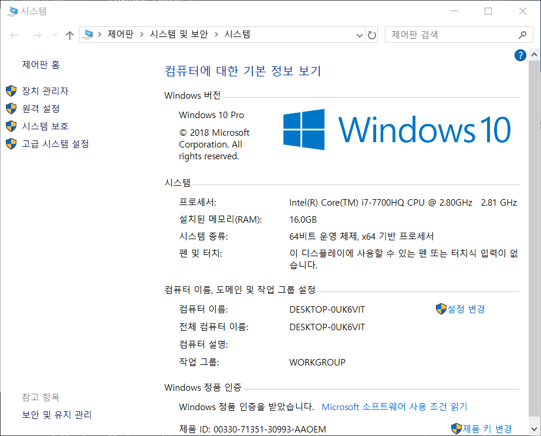

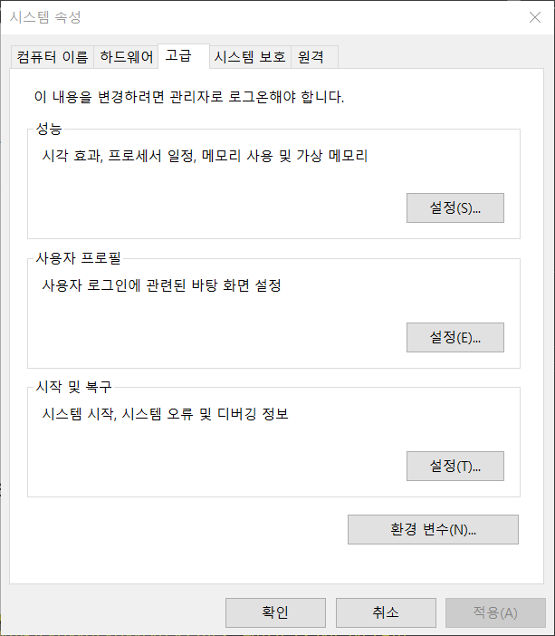

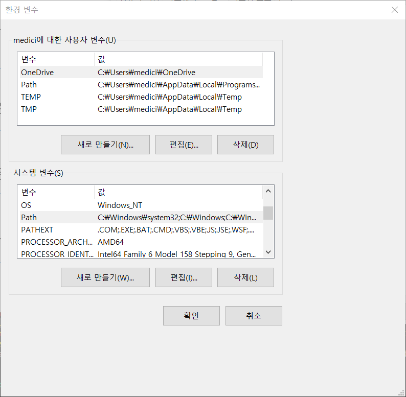

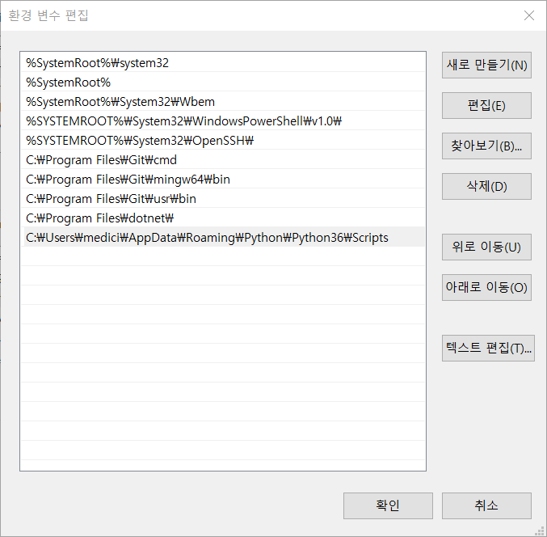

### msvc.dll 업그래이드

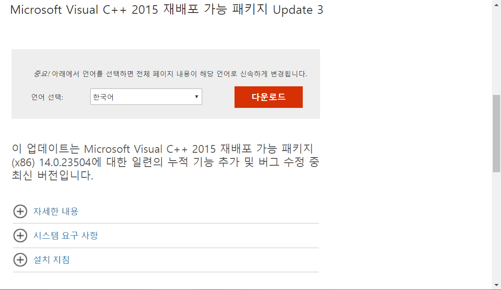

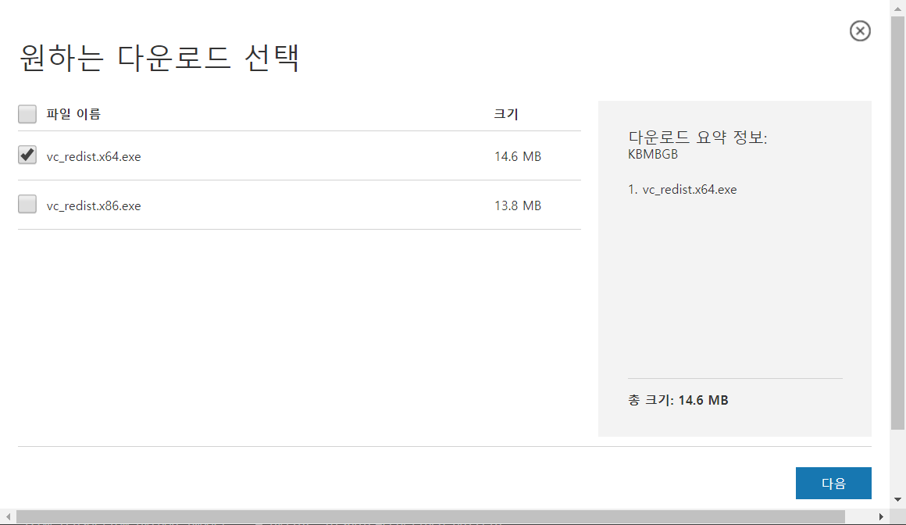

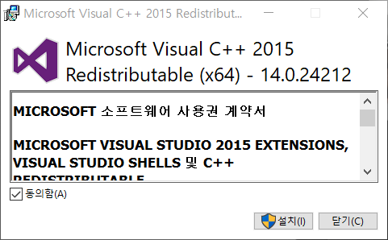